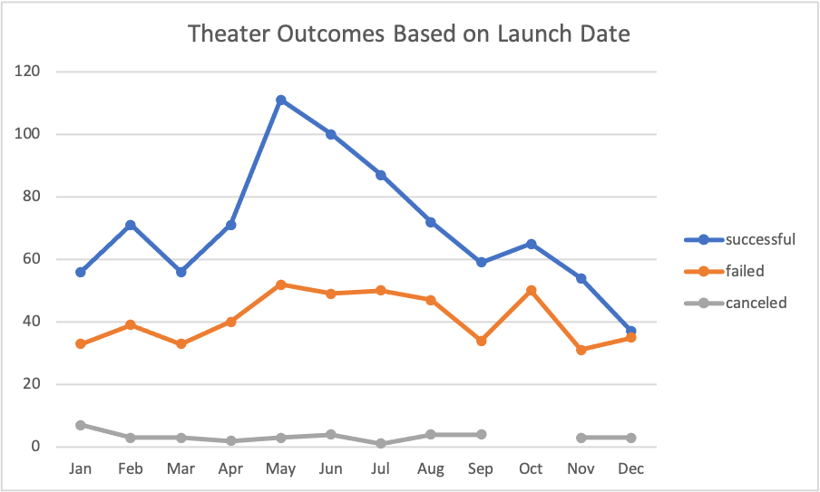
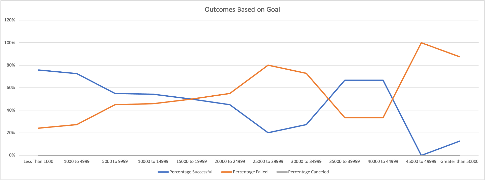

# Kickstarting with Excel

## Overview of Project
The following project will look to an analysis of crowdfunding data (Kickstarter) in efforts to assist an up and coming playwright, Louise, to understand the performance of crowdfunding campaigns in relation to their launch date and funding goals. Louise's play, *Fever*, is also fundraising through crowdfunding and was able to achieve a good amount of her goal in a short amount of time.

### Purpose
The resulting analysis of the crowdfunding data will provide a summary of information and visuals to aid Louise to make decisions about her own fundraising campaign. The summary of analysis will provide an understanding of the campaigns most similar to that for *Fever* and will allow Louise to understand the timing and goal size in order to have a successful campaign as well. The information will also provide Louise an idea of the timing and fundraising goals to avoid.

## Analysis and Challenges
The below analysis and visualization will focus on the following two factors:
1. Outcomes based on Launch Date
2. Outcomes Based on Goals

### Analysis of Outcomes Based on Launch Date
This analysis focuses on the outcomes of campaigns for the category of "theater" and their results based on the month that they were launched. This was conducted by creating a PivotTable and filtering in order to compare the various outcomes (successful, failed, canceled) for "theater" for each month. A line chart was then created to visualize the information. Looking at the results, it can be concluded or suggested that May is the best month to launch campaigns, with the highest number of "successful" crowdfunding efforts. In the months following May, the number of successful outcomes experiences a consistent decline. Campaigns launched in December fared the worst and so by extension, it would be suggested to avoid December as a launch date.

### Analysis of Outcomes Based on Goals
Similarly, the next part of the analysis focuses on the outcomes of campaigns based on the amount of the fundraising goals in the subcategory "plays". The initial Kickstarter data was collated using the COUNTIFS function in Excel based on various ranges of fundraising goals and the percentage of whether they were "successful", "failed" or "canceled" were calculated out of all the projects. In the subcategory "plays", none of the campaigns were canceled. Based on the below visualization, it can be seen that a higher percentage of goals less than $20,000 were more likely to succeed rather than fail. The data suggests that as the fundraising goals increased, the chance of failure did as well. There is a counter to this trend between the $35,000 to $44,999 range where projects with higher goals experienced more success than failure.

### Challenges and Difficulties Encountered
A common challenge of working with datasets is the existence of outliers in the data. A decision that needs to be made is whether it is necessary to remove outliers or leave them in the dataset. An example of an outlier in this dataset can be found in the range of fundraising goals, which range from $1.00 to $100,000,000. Having collated separate set of data focusing on "theater" and "play" categories, the outlier in the case does not skew or contribute to the analysis.

Another important consideration of data analysis is the data cleanup, inclusive of presentation and formatting. As an example, the initial Kickstarter file contained date information in the Unix time format, which needed to be converted for ease of use in the other elements of analysis. This was done using the YEAR() function.

A difficulty in the completion of this analysis was the use of GitHub and the presentation of the analysis using Markdown syntax. Some research was required in order to properly upload and display the visuals created in the course of the analysis.

## Results
### Conclusions from Outcomes based on Launch Date:
* May, June, July have the highest number of successful projects. Louise may consider a campaign launch in one of these months for a higher chance of success.
* Louise should avoid launching her campaign in December as it had the least number of successful campaigns.
* Despite the higher number of successful projects in the months from May to July, there is a slight spike in the number of failed projects.

### Conclusions from Outcomes based on Goals:
* The percentage of failed projects increase in correspondence with the increase in the ranges of fundraising goals, suggesting that projects with higher goals are more likely to fail. Based on the visualization, Louise should cap her campaign at less than $20,000 as the percentage of successful projects surpass failed until that point.
* As noted, there is a change in the trend in the between the $35,000 to $44,999 range.

### Limitations of Dataset:
* The dataset contains 4,114 crowdfunding campaigns and details from users of the Kickstarter platform. Of the 4,114 approximately 1/4 (1,066) of the data was from campaigns for the "theater/ plays" category. The analysis for Louise could benefit from having more data points that closely relate to her campaign's goal, which is funding her play *Fever*. Additionally, there are other crowdfunding platforms that Louise can use. An analysis or comparison of data from other platforms can help Louise to determine whether Kickstarter is the best platform for her project.
* The data also contained information for "live" as well as "canceled" campaigns. In the "plays" subcategory, there were no canceled campaigns to analyze. It would be helpful to understand the difference between "canceled" and "failed". While Louise can look to the "live" campaigns for more information on whether the data is relevant to her purpose, the dataset contains only campaign information until 2017. In this analysis, Louise would benefit most from the latest information as crowdfunding for creative projects maybe be influenced by societal and economic factors dependent on time.

### Alternative Approaches:
In this analysis, a line chart was used to visualize the data manipulations. While line charts are effective in showing the comparisons of data points in relation to various points in time, other charts could have been used. As an example, a stacked bar chart would be able to display the same comparisons. Other approaches to the data may provide further insight to Louise and her crowdfunding efforts. The Kickstarter dataset included the Country for each project as well as a description of the project seeking funding. It may be helpful for Louise to have a comparison of outcomes of the "theater/ plays" category between countries to determine if geography will influence the success of her campaign. It may also be helpful to examine the descriptions of the various projects to find those similar to Louise's play, *Fever* to see how those projects fared.
